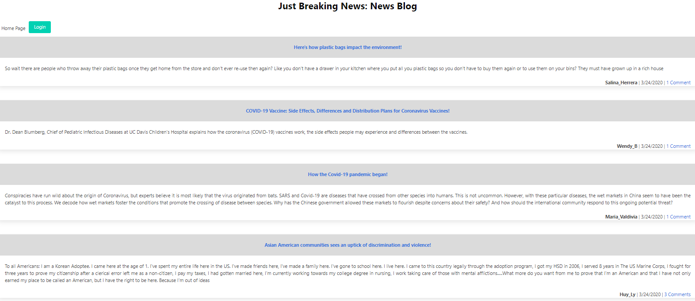

<h1 align="center">✌️🤟🙏👋  E-Commerce Website Backend  ✌️🤟🙏👋</h1>
<h1 align="center">

</h1>

## Description 

  *The what, why, and how:* 
  
  🔍 Internet retail, also known as e-commerce, is the largest sector of the electronics industry, having generated an estimated US$29 trillion in 2017 (Source: United Nations Conference on Trade and Development). E-commerce platforms like Shopify and WooCommerce provide a suite of services to businesses of all sizes. Due to the prevalence of these platforms, developers should understand the fundamental architecture of e-commerce sites.
Your challenge is to build the back end for an e-commerce site. You’ll take a working Express.js API and configure it to use Sequelize to interact with a MySQL database.
Because this application won’t be deployed, you’ll also need to create a walkthrough video that demonstrates its functionality and all of the following acceptance criteria being met. You’ll need to submit a link to the video and add it to the README of your project. 

 *Check out the [ExampleREADME.md](https://github.com/emilychhun/MVC-tech-blog/blob/main/README.md) as an example.*
   
 
  ## Table of contents
 - [Installation](#installation)
 - [Tech Used](#tech-used)
 - [Questions](#questions)
 - [Links](#links)
 - [License](#license) 
   

 ## Installation

  *Steps required to install project and how to get the development environment running:*
  
💽💽 Installation is a process of installing the dependencies required. Intialize node package manager and then run the following commands:
   
      1.npm install mysql2
   
      2.npm install sequelize
   
      3.npm install dotenv
   
      4.download express-handlebars
   
      5.Express packages
   

  
  
  ## Tech Used
  *Instructions and examples for use:*
    
 1. Node
 2. Express
 3. MySQL
 4. Sequelize
 5. Dotenv
  
  *Demo*

  View a demonstration of the application:
   
  
  

  

   
  
 
  
  ## Licence
  📝📑
  
  
   
  
 
  ## Contributors
  💆🏽💆🏻‍♂️👳🏽👳🏽👳🏻‍♀️👨🏾‍🦽👨🏿‍🤝‍👨🏾As I use this for my own projects, i want to contribute to everybody such as students, my friends, and other users. I know this might not be the perfect README for all projects out there. If your vision of a perfect README.md differs greatly from mine, tell me what you think and we open an issue. If you'd like to contribute,  please do pull requests and make changes as you'd like. In this case, you can create a new file README-yourplatform.md and create the perfect boilerplate for that.
   
 
 
  ## Test
  🥇 *Tests for application and how to run them:*
 
   There is no test information for this application at this time.
   
 
  ## Questions
   

   *✋For any questions, please contact me with the information below:*
   

 Find me on GitHub: [emilychhun](https://github.com/emilychhun)
  

  Email me with any questions: emily_chhun23@yahoo.com
   

  repo link: [readme-repo-link](https://github.com/emilychhun/MVC-tech-blog)
    

  

